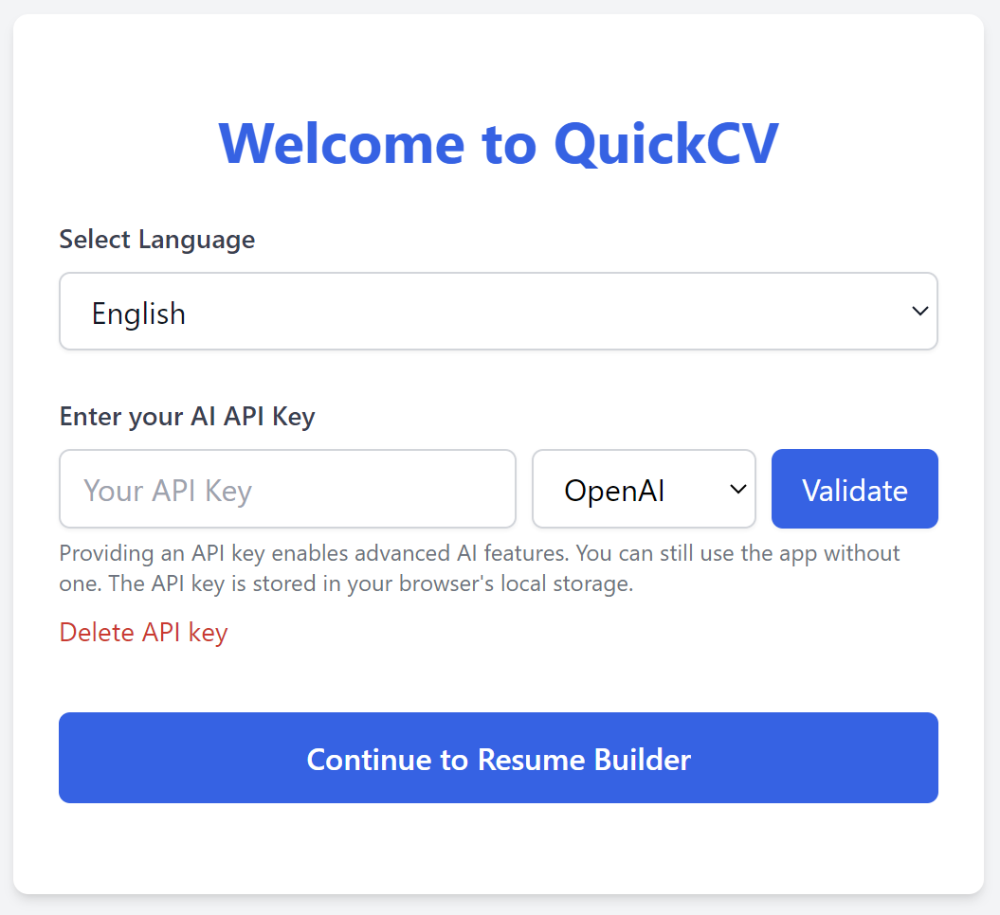
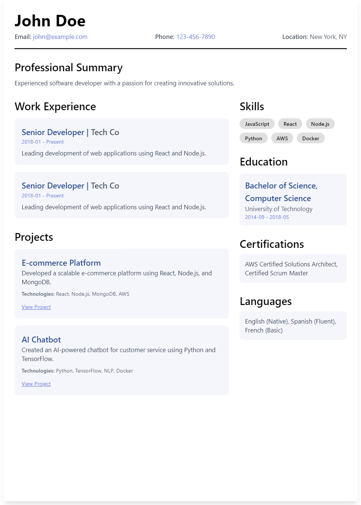
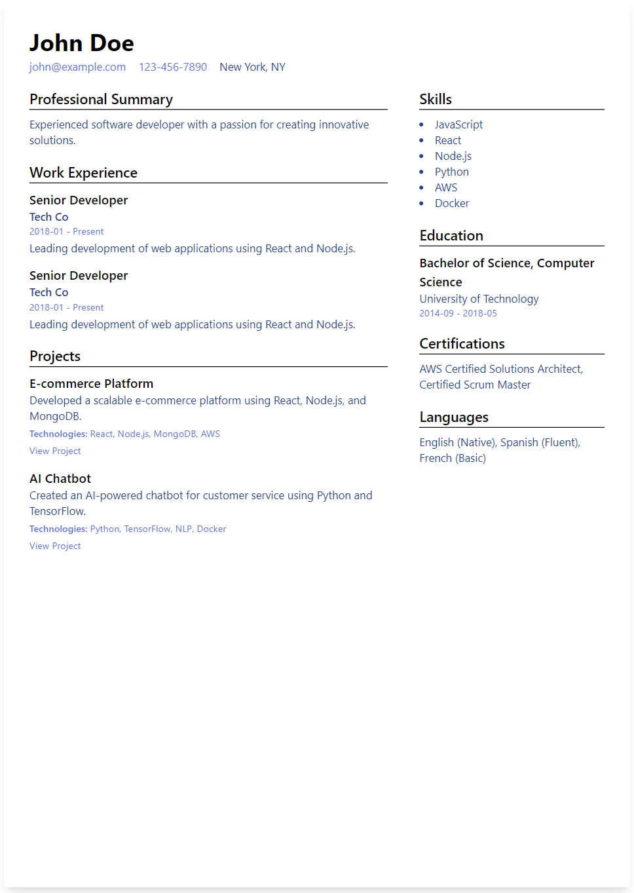
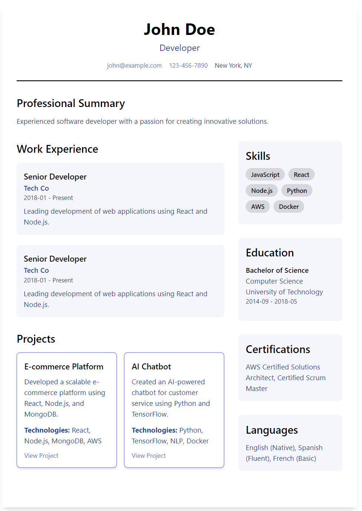
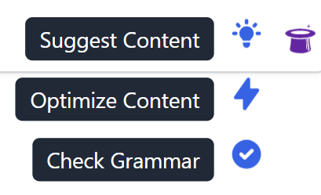
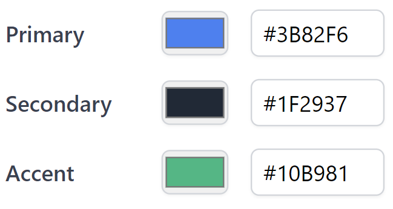

<div align="center">

# QuickCV


### A Modern, AI-Powered Resume Builder

[](https://nextjs.org/)
[](https://www.typescriptlang.org/)
[](https://tailwindcss.com/)

</div>

## ✨ Overview

**QuickCV** transforms the resume creation process with AI-powered assistance, professional templates, and intuitive customization options. Built for modern professionals using cutting-edge web technologies.

<div align="center">



</div>

## 🚀 Key Features

<table>
<tr>
<td width="50%">

### 📝 Smart Resume Building

- ~~Multiple professional templates~~ English only
- AI-powered content suggestions
- Grammar checking
- Customizable sections

</td>
<td>

### 🌈 Customization

- Custom color themes
- Flexible layouts
- Section reordering
- Export
- **Template Addition (Alpha)**

</td>
</tr>
</table>

## 💫 Templates Gallery

<div align="center">
<table>
<tr>
<td align="center">

<br />
<b>Default Template</b>
</td>
<td align="center">

<br />
<b>Modern Template</b>
</td>
<td align="center">

<br />
<b>CleanCard Template</b>
</td>
</tr>
</table>
</div>

## 🤖 AI Features

<div align="center">



</div>

### Smart Suggestions

- ✍️ Project descriptions
- 💼 Work experience optimization
- 🎯 Skills recommendations
- 📝 Professional summary generation

### Content Enhancement

- 📊 Experience impact metrics
- 🔍 Keyword optimization
- ✨ Action verb suggestions
- 🎯 Industry-specific terms

## 🛠️ Tech Stack

- **Frontend Framework:** Next.js 14
- **Type Safety:** TypeScript
- **Styling:** Tailwind CSS
- **Internationalization:** next-i18next
- **State Management:** React Context
- **AI Integration:** OpenAI API

## 📦 Installation

```bash
# Clone the repository
git clone https://github.com/NehoraiHadad/quickCV

# Navigate to project directory
cd quickCV

# Install dependencies
npm install
# or
yarn install

# Start development server
npm run dev
# or
yarn dev
```

## 📂 Project Structure

```
quickcv/
├── src/
│   ├── app/                # Next.js app directory
│   ├── components/         # React components
│   │   ├── AIFeatures/     # AI-related components
│   │   ├── ResumeBuilder/  # Resume builder components
│   │   └── Templates/      # Resume templates
│   ├── context/           # React context
│   ├── hooks/             # Custom hooks
│   ├── i18n/              # Internationalization
│   ├── types/             # TypeScript types
│   └── utils/             # Utility functions
├── public/               # Static files
└── ...config files
```

## 🌐 Language Support

<div align="center">

Currently supporting:
🇺🇸 English | ~~🇮🇱 Hebrew~~

</div>

## 🎨 Theme Customization

<div align="center">



Choose from multiple color schemes or create your own custom theme.

</div>

## 🤝 Contributing

We welcome contributions! Please follow these steps:

1. Fork the repository
2. Create your feature branch (`git checkout -b feature/AmazingFeature`)
3. Commit your changes (`git commit -m 'Add some AmazingFeature'`)
4. Push to the branch (`git push origin feature/AmazingFeature`)
5. Open a Pull Request

## 📄 License

This project is licensed under the MIT License.

## 💝 Acknowledgments

- [Geist Font](https://vercel.com/font) by Vercel
- [Tailwind CSS](https://tailwindcss.com/)
- [Next.js](https://nextjs.org/)

---

<div align="center">

Made with ❤️ by [Nehorai Hadad](https://github.com/NehoraiHadad)

[Report Bug](https://github.com/NehoraiHadad/quickCV/issues) · [Request Feature](https://github.com/NehoraiHadad/quickCV/issues)

</div>
